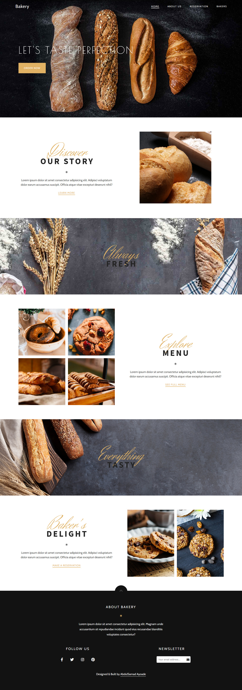

# Bakery
 
 

Bakery is a mobile first, clean and responsive template built for a bakery.

Built using HTML, CSS and Javascript.

Scroll Reveal, a Javascript library that reveal elements when a user scroll into them is also used in the project.

All the images were gotten from Unsplash and Pexels.

The project contains three pages which are:

1. The Homepage

2. About Page - This contains few details about the bakery.

3. Bakers - This page contains a gallery of the bakers.

Live Url = https://abdulsamadayoade.github.io/Bakery
